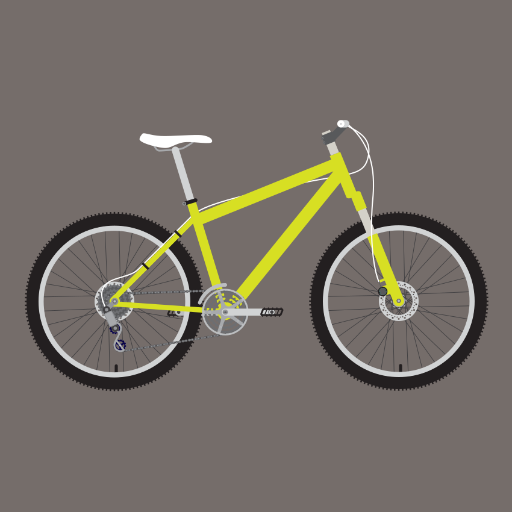

#Utility Bikes

A utility bicycle is a bicycle designed for practical transportation, as opposed to bicycles which are primarily designed for recreation and competition, such as racing bicycles, and mountain bicycles. The vast majority of bicycles can be found in the developing world, and are utility bicycles. As such utility bicycles are the most common form of bicycle globally.

Utility bicycles are principally used for short-distance commuting, running errands, shopping, leisure or for transporting goods or merchandise.