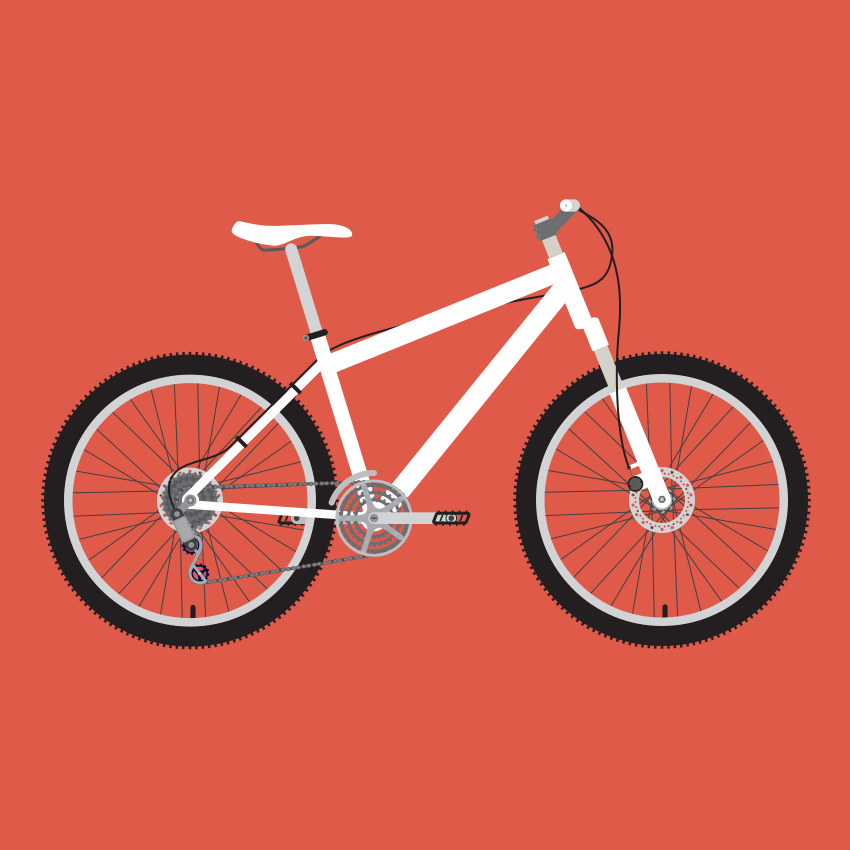

#Racing Bikes

The most important characteristics about a racing bicycle are its weight and stiffness which determine the efficiency at which the power from a rider's pedal strokes can be transferred to the drive-train and subsequently to its wheels. To this effect racing bicycles may sacrifice comfort for speed. The drop handlebars are positioned lower than the saddle in order to put the rider in a more aerodynamic posture. The front and back wheels are close together so the bicycle has quick handling. The derailleur gear ratios are closely spaced so that the rider can pedal at their optimum cadence. Other racing bicycles, especially those used in time trialling, prioritize aerodynamics over comfort.