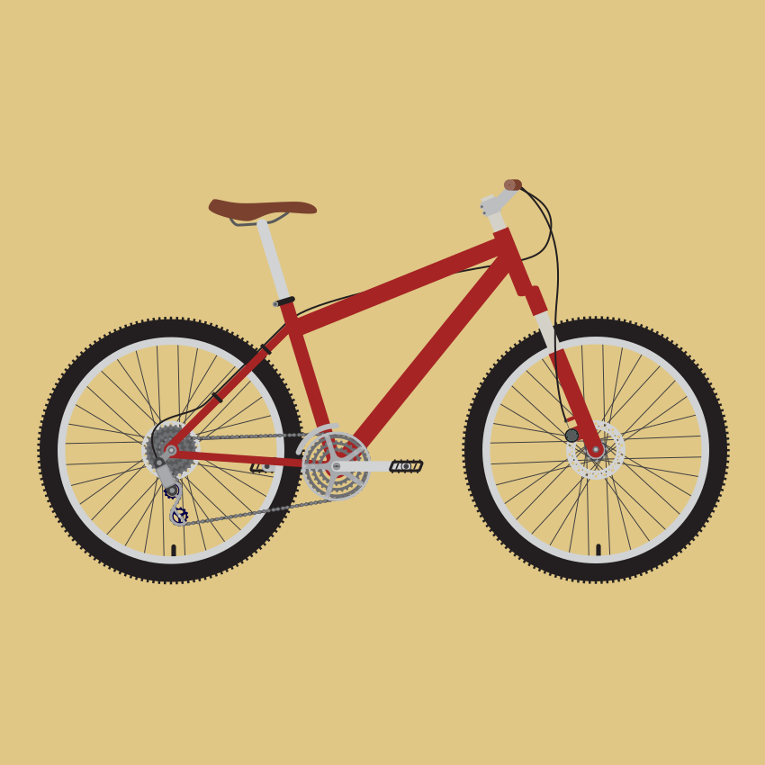

#BMX Bikes

A BMX bike or BMX is the name of a popular bicycle used for both casual riding and sport, and designed mainly for dirt and motocross cycling. "BMX" is the usual abbreviation for bicycle motocross.

Though originally denoting a bicycle intended for BMX Racing, the term "BMX bike" is now used to encompass **race** bikes, as well as those used for the **dirt**, **vert**, **park**, **street**, **flatland** and **freestyle** disciplines of BMX. BMX frames are made of various types of steel, and (largely in the racing category) aluminum. Cheaper, low end bikes are usually made of steel. High range bikes are mostly chromoly or high tensile steel, although the latter is noticeably heavier with respect to strength. High-performance BMX bikes use lightweight 4130 chromoly, or generation 3 chromoly.