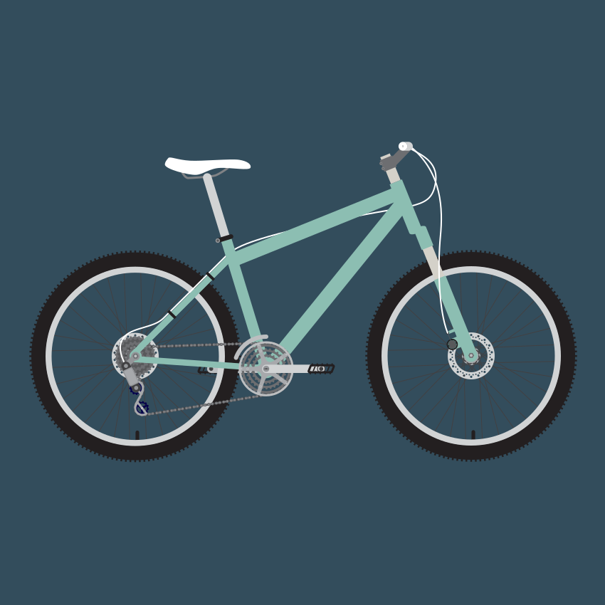

#Cruiser Bikes

A cruiser bicycle, also known as a beach cruiser, is a bicycle which combines balloon tires, an upright seating posture, a single-speed drivetrain, and straightforward steel construction with expressive styling. Cruisers are popular amongst casual bicyclists and vacationers because they are very stable and easy to ride, but their heavy weight and balloon tires tend to make them rather slow. They are associated with the larger category of hybrid bicycles.

The bikes, noted for their durability and heavy weight, were the most popular bicycle in the United States from the early 1930s through the 1950s, and have enjoyed renewed popularity since the late 1990s.