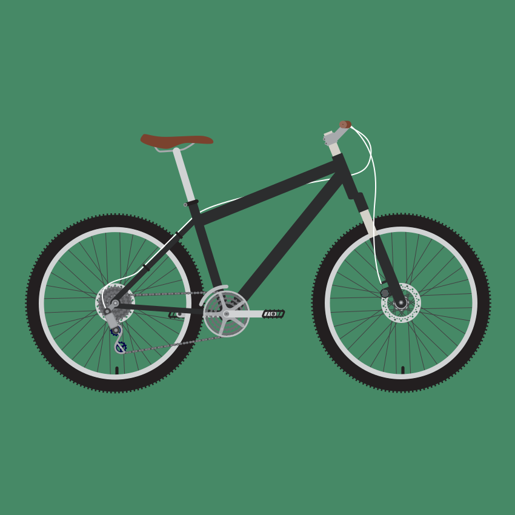

#Electric Bikes

An electric bicycle, also known as an e-bike, is a bicycle with an integrated electric motor which can be used for propulsion. There are a great variety of different types of e-bikes available worldwide, from e-bikes that only have a small motor to assist the rider's pedal-power (i.e. pedelecs) to somewhat more powerful e-bikes which tend closer to moped-style functionality: all however retain the ability to be pedalled by the rider and are therefore not electric motorcycles. E-bikes use rechargeable batteries and the lighter varieties can travel up to 25 to 32 km/h (16 to 20 mph), depending on the laws of the country in which they are sold, while the more high-powered varieties can often do in excess of 45 km/h (28 mph).

Depending on local laws, many e-bikes (e.g. pedelecs) are legally classified as bicycles rather than mopeds or motorcycles, so they are not subject to the more stringent laws regarding their certification and operation, unlike the more powerful two-wheelers which are often classed as electric motorcycles.