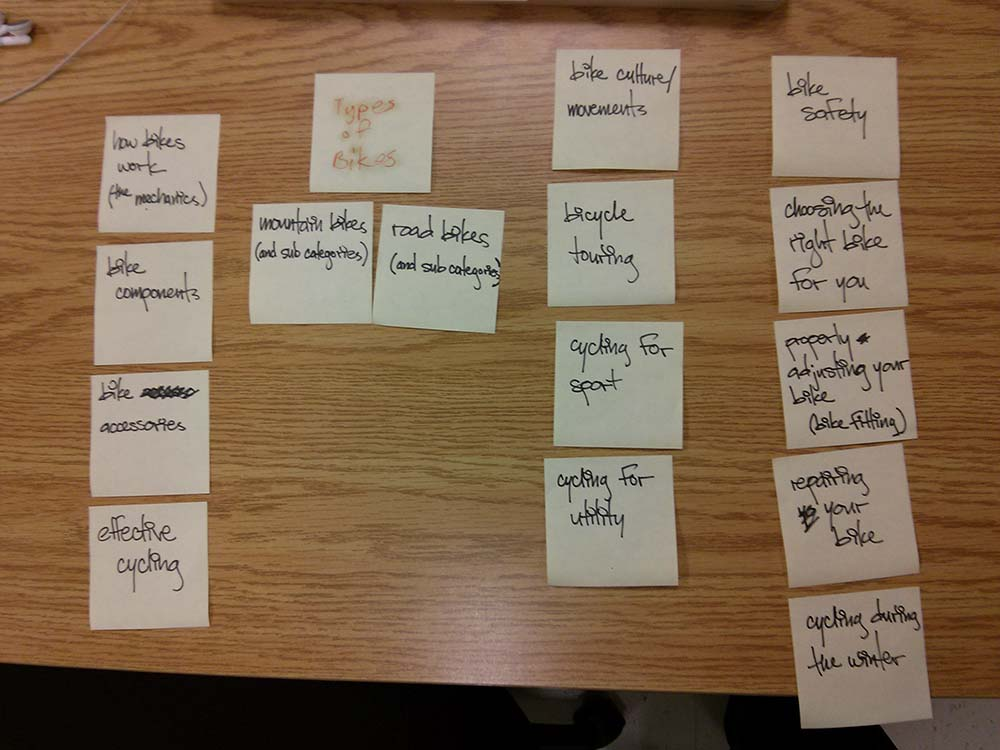
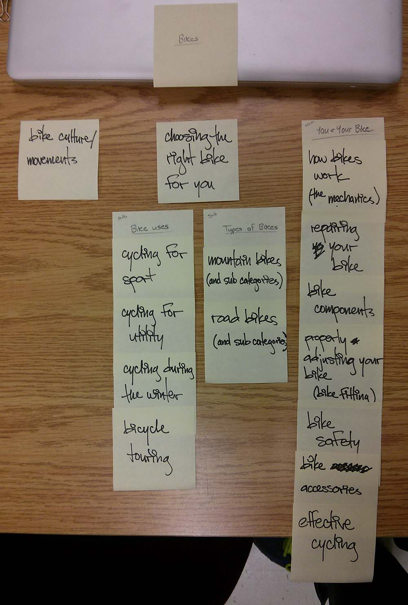

# Card sort report

The purpose of this card sort was to determine common navigation patterns and categories from the content of bicycles.

## Specifics

The card sort was conducted by Chris Chan on September 10th, 2013 between the times of 4PM and 5PM with the following participants:

- Lisa Villeneuve
- Amy Brown

### Cards

15 cards were used covering a broad range of applicable content for the website. The following topics were used as cards:

1. Effective Cycling
2. How bikes work (the mechanics)
3. Repairing your bike
4. Bike components
5. Properly adjusting your bike (bike fitting)
6. Bike safety
7. Bike accessories
8. Choosing the right bike for you
9. Mountain bikes (and subcategories)
10. Road bikes (and subcategories)
11. Cycling for sport
12. Cycling for utility
13. Cycling during the winter
14. Bicycle touring
15. Bike culture/movements

## Card sort results

*Card sort 1 by Lisa Villeneuve*

*Card sort 2 by Amy Brown*

## Observations

- I was unaware that I was to make observations and inqueries to my participants' decisions, and unfortunately did not manage to collect data on their experience of sorting. Seeing as this was my first card sort, this error will not be repeated.
- Both participants made similar common groupings; the only notabile difference being a subdivision of *mechanics* and *safety* in sort 1 that were not present in sort 2
- The names of cards should be more discriminating. Participant 1 seemed to have difficulty deciding whether cards should be filed under *safety* or *mechanics* (although arguably, they are interrelated)
- Both sorts were for the most part in accordance to my pre-concieved expectations. Discrepancies were minor, but insightful.
- I was surprised that *choosing the right bike for you*—which I had intended to be a category on it's own—was filed under the subcategory of *safety*. However, I can follow the participant's logic.
- I like participant 2's idea of making *bike culture/movements* a subcategory on its own. Within the context of this card being a subcategory, I believe it should be renamed *Biking: why we do it*